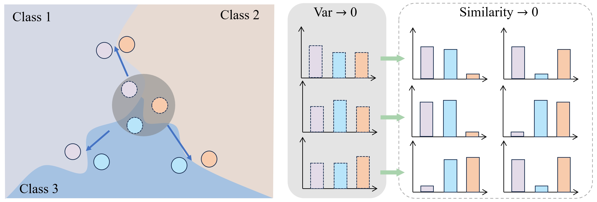

# This repository contains the code release for **Exploring Query Efficient Data Generation towards Data-free Model Stealing in Hard Label Setting**
## Abstract
Data-free model stealing involves replicating the functionality of a target model into a substitute model without accessing the target model's structure, parameters, or training data. The adversary can only access the target model's predictions for generated samples. Once the substitute model closely approximates the behavior of the target model, attackers can exploit its white-box characteristics for subsequent malicious activities, such as adversarial attacks. Existing methods within cooperative game frameworks often produce samples with high confidence for the prediction of the substitute model, which makes it difficult for the substitute model to replicate the behavior of the target model. This paper presents a new data-free model stealing approach called Query Efficient Data Generation (**QEDG**). We introduce two distinct loss functions to ensure the generation of sufficient samples that closely and uniformly align with the target model's decision boundary across multiple classes. Building on the limitation of current methods, which typically yield only one piece of supervised information per query, we propose the query-free sample augmentation that enables the acquisition of additional supervised information without increasing the number of queries.  Motivated by theoretical analysis, we adopt the consistency rate metric, which more accurately evaluates the similarity between the substitute and target models. We conducted extensive experiments to verify the effectiveness of our proposed method, which achieved better performance with fewer queries compared to the state-of-the-art methods on the real **MLaaS** scenario and five datasets.


## How to run
* We should train the substitute model first. We take the MNISR dataset as an example.
```
python train_scratch.py --dataset=mnist --epochs=50 --net=resnet34
```
The weight of the target model will be saved in ```./target_model_weight```
* Generate the adversarial attacks by white-box attacks and transfer them to the attacked model. When the substitute model is obtained, you can use the following command to evaluate the substitute model:

```
python main.py --black_net=resnet34 --batch_size=256 --nz=512 --query=5000 --select_threshold=0.7
```

# Citation
```
@article{pei2024exploring,
  title={Exploring Query Efficient Data Generation towards Data-free Model Stealing in Hard Label Setting},
  author={Pei, Gaozheng and Ma, Ke and Yang, Pinci and Xu, Qianqian and Sun, Yingfei and others},
  journal={arXiv preprint arXiv:2412.15276},
  year={2024}
}
```
